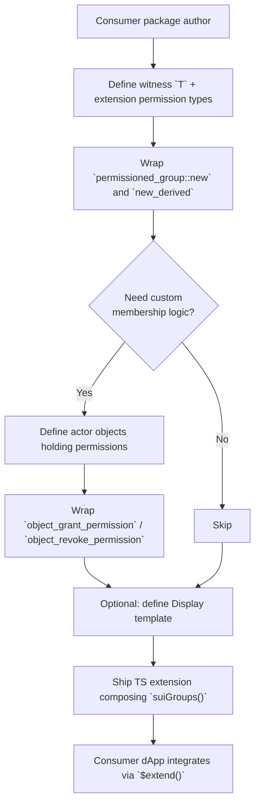
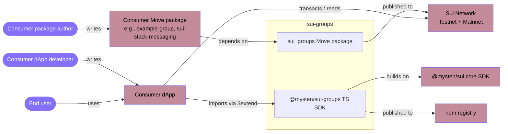
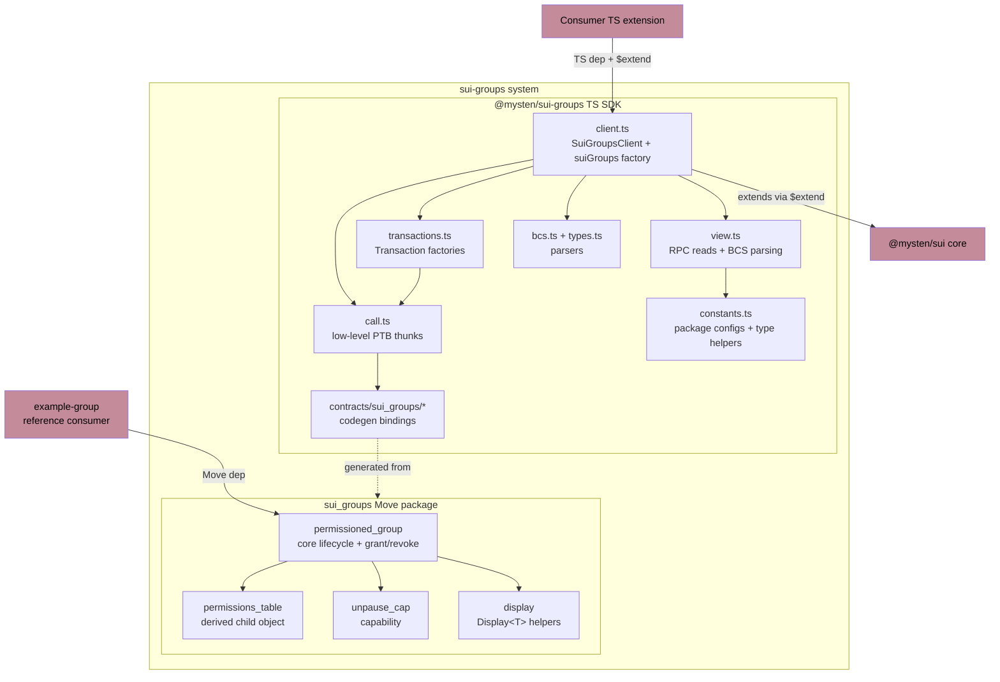
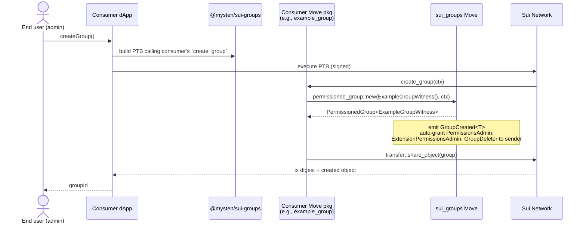
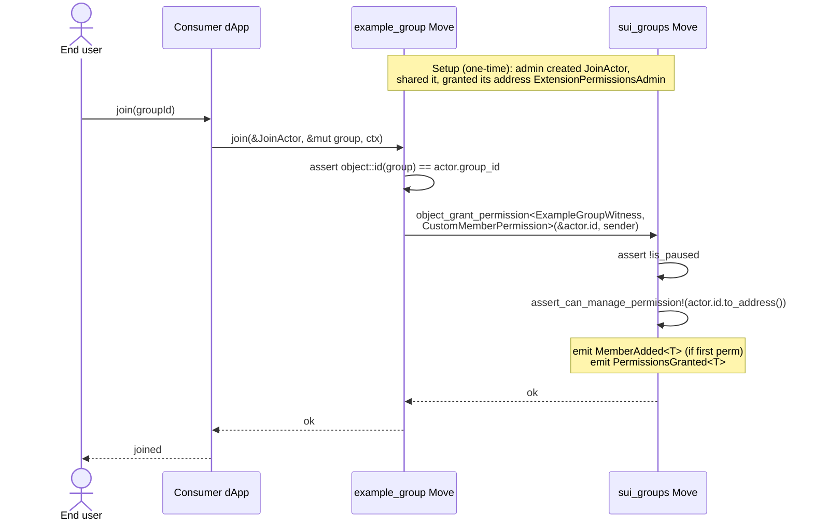
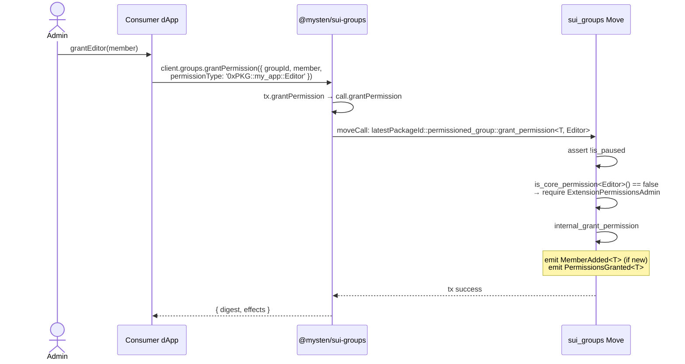
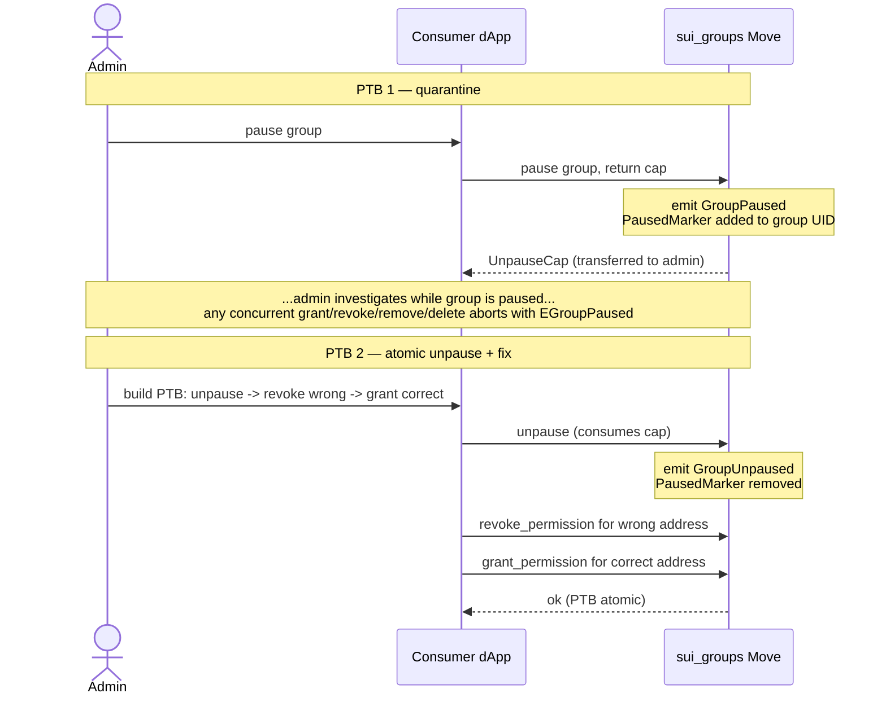
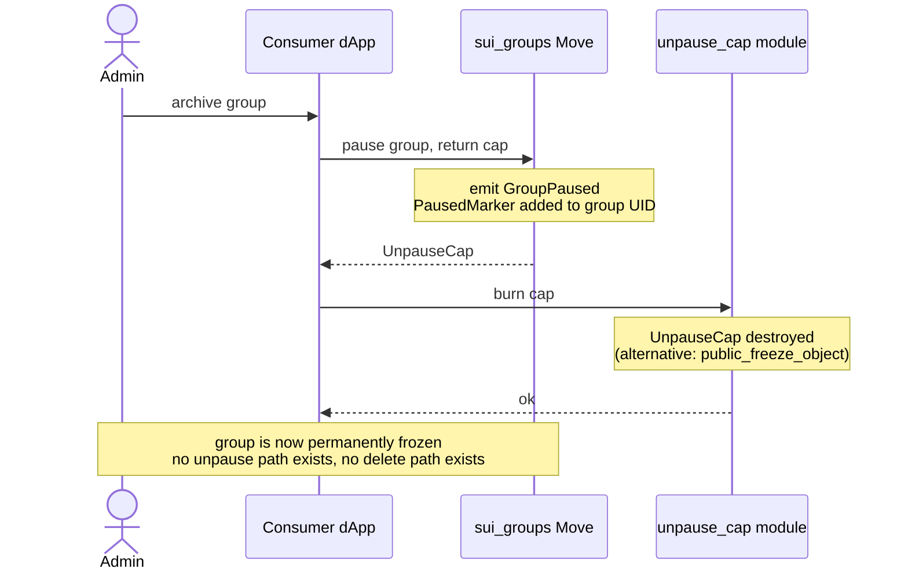

# Technical Design Document — `sui-groups`

> **Status:** Beta (Testnet + Mainnet)
>
> This document is a **map**, not a manual. It captures architectural decisions, system context, key flows, and threats. For implementation details, defer to the linked source documents. See [README.md](../README.md), [SmartContracts.md](./SmartContracts.md), and [Extending.md](./Extending.md).

---

## 1. Overview & Scope

`sui-groups` is a **Move library + TypeScript SDK** pair for managing groups with fine-grained, type-based permissions on Sui. It is consumed by other Sui projects (e.g., `sui-stack-messaging` builds encrypted messaging groups on top of it). The repository showcases [`example-group`](../move/packages/example-group/) as a reference consumer package.

**Framing:** this is a **library**. Extension points — witness scoping, the actor-object pattern, extension permissions — are the product surface. The TDD foregrounds these over end-user feature flows.

**Non-goals & out of scope:**

- No off-chain runtime, indexer, or backend.
- No built-in persistence outside Sui state.
- This TDD omits the "Database Design" template section (no DB) and C4 Levels 3 & 4 (auto-generated Move/TS reference docs cover that depth — see [SmartContracts.md](./SmartContracts.md), [APIRef.md](./APIRef.md)).

Links: [README.md](../README.md), [SmartContracts.md](./SmartContracts.md), [Extending.md](./Extending.md), [Setup.md](./Setup.md).

---

## 2. Architectural Decision Records

Six load-bearing decisions. Detailed rationale lives in the linked source docs; this section is the index of _why_ the architecture looks the way it does.

### ADR-1 — Witness-scoped generic groups: `PermissionedGroup<T>`

**Decision:** every group and its permission universe is parameterized by a phantom witness `T` owned by the consumer package. `permissioned_group::new` takes a `_witness: T` and only the package defining `T` can construct instances of it.

**Rationale:** witness ownership gives multi-tenant isolation for free — two consumers cannot cross-read, cross-mutate, or cross-grant. Avoids a centralized package-id allowlist.

**Consequences:** consumers must define a witness type and write thin wrappers around `new`/`new_derived`/`object_*`. The TS SDK deliberately does not expose these (see [§6.4 Intentional Gaps](#64-intentional-gaps)).

### ADR-2 — UID-based actor pattern for cross-package delegation

**Decision:** `object_grant_permission`, `object_revoke_permission`, `object_remove_member`, `object_uid`, `object_uid_mut` take `actor_object: &UID`. The library checks `actor_object.to_address()` against the relevant manager permission.

**Rationale:** `&UID` is module-private in Move, so only the module defining the actor struct can synthesize the call. Consumers can layer arbitrary custom membership logic (paid join, NFT-gated join) while `sui_groups` continues to enforce the actor's address holds the required manager permission. See [`example_group.move:96`](../move/packages/example-group/sources/example_group.move#L96) for the `JoinActor` reference.

### ADR-3 — Membership is defined by permissions

**Decision:** a member exists iff they hold ≥1 permission. `grant_permission` auto-adds; the last `revoke_permission` auto-removes. There is no separate "add member" entrypoint.

**Rationale:** removes a redundant concept layered on top of the permissions table and eliminates an entire bug class ("member without permissions" / "permission without membership"). Event emission sites are correspondingly narrow: `MemberAdded`/`MemberRemoved` fire exactly at the transitions.

### ADR-4 — Two-class permission model with macro-enforced separation

**Decision:** four built-in **core** permissions (`PermissionsAdmin`, `ExtensionPermissionsAdmin`, `ObjectAdmin`, `GroupDeleter`) are managed _only_ by `PermissionsAdmin`. All third-party permissions are **extension** permissions, managed _only_ by `ExtensionPermissionsAdmin`. Enforced by [`assert_can_manage_permission!`](../move/packages/sui_groups/sources/permissioned_group.move#L640) and the [`is_core_permission`](../move/packages/sui_groups/sources/permissioned_group.move#L629) whitelist.

**Rationale:** prevents `ExtensionPermissionsAdmin` from privilege-escalating to `PermissionsAdmin`. Gives consumers a clean delegation surface: hand out `ExtensionPermissionsAdmin` to actors without risking core-admin compromise. Explicit whitelist is more auditable than a package-level check.

### ADR-5 — Dual package ID config (`originalPackageId` + `latestPackageId`)

**Decision:** the TS SDK's `SuiGroupsPackageConfig` carries both V1 and latest package IDs. MoveCall targets use `latestPackageId`; TypeName strings, BCS parsing, and `deriveObjectID` use `originalPackageId`.

**Rationale:** Move's `type_name::with_original_ids()` always references V1 addresses. A post-upgrade SDK that used the latest ID for type names would silently fail permission comparisons and dynamic-field lookups. Separating the two in config makes upgrade semantics explicit and MVR-compatible. See [`constants.ts`](../ts-sdks/packages/sui-groups/src/constants.ts) and [`types.ts`](../ts-sdks/packages/sui-groups/src/types.ts).

### ADR-6 — `UnpauseCap<T>` as a consumable capability

**Decision:** [`pause()`](../move/packages/sui_groups/sources/permissioned_group.move#L291) returns an `UnpauseCap<T>` owned object that [`unpause()`](../move/packages/sui_groups/sources/permissioned_group.move#L303) consumes. Burning or freezing the cap makes the paused state permanent.

**Rationale:** one primitive, two behaviors — quarantine-and-recover (pause in one PTB, atomic unpause-and-fix in a follow-up PTB; see [§7.4](#74-quarantine-and-recover-two-ptbs)), and permanent archive (pause then burn the cap; see [§7.5](#75-permanent-archive-burn-unpausecap)). No separate `archive()` function or mutable `is_archived` flag.

Links: [SmartContracts.md](./SmartContracts.md), [Extending.md](./Extending.md), [`move/design_docs/sui_groups/permissioned_group.md`](../move/design_docs/sui_groups/permissioned_group.md).

---

## 3. Use Cases

Roles are defined relative to the **library boundary**. "Consumer package" means a downstream Move package that depends on `sui_groups`. "Consumer dApp" means a TS/UI application wiring up the SDK. "End user" is a wallet holder acting through the consumer dApp.

- **Consumer package author** → Define a group type (write witness `T`, wrap `permissioned_group::new`, declare extension permissions).
- **Consumer package author** → Implement custom membership flows via actor objects (self-service join, token-gated join, paid join) using the `&UID`-based `object_*` API.
- **Consumer dApp developer** → Integrate the TS SDK via `$extend(suiGroups({ witnessType }))` and pick a tier: `view` / `call` / `transactions` / imperative.
- **Group admin (end user via dApp)** → Manage membership: grant/revoke permissions, remove members.
- **Group admin** → Quarantine the group while investigating bad state, then atomically unpause-and-fix in a follow-up PTB (see [§7.4](#74-quarantine-and-recover-two-ptbs)).
- **Group admin** → Permanently archive a finished group by pausing then burning the `UnpauseCap` (see [§7.5](#75-permanent-archive-burn-unpausecap)).
- **Reader (end user or indexer)** → Query group state via `view` (membership, permissions, paused). The SDK locally derives the `PermissionsTable` ID and dynamic-field IDs, then fetches them via plain `getObject` / `listDynamicFields` (no devInspect, no signing, no gas).

### 3.1 Consumer Integration Flow

Links: [Extending.md](./Extending.md) for the full walkthrough.

---

## 4. C4 Diagrams

### 4.1 Level 1 — System Context

### 4.2 Level 2 — Containers

Links: [`ts-sdks/packages/sui-groups/src/`](../ts-sdks/packages/sui-groups/src/), [`move/design_docs/sui_groups/`](../move/design_docs/sui_groups/).

---

## 5. Smart Contract Design

The Move library is intentionally small: four modules, witness-scoped generics, type-based permissions stored in a derived child object. For exhaustive struct/function reference, see [`move/design_docs/sui_groups/`](../move/design_docs/sui_groups/) and [SmartContracts.md](./SmartContracts.md).

### 5.1 Module Map

| Module                                                                              | Purpose                                                                                      |
| ----------------------------------------------------------------------------------- | -------------------------------------------------------------------------------------------- |
| [`permissioned_group`](../move/packages/sui_groups/sources/permissioned_group.move) | Group lifecycle, grant/revoke, pause, delete, all events. The library's primary entrypoint.  |
| [`permissions_table`](../move/packages/sui_groups/sources/permissions_table.move)   | Derived child of group UID; stores `address → VecSet<TypeName>` as dynamic fields.           |
| [`unpause_cap`](../move/packages/sui_groups/sources/unpause_cap.move)               | Owned capability gating `unpause`; burnable for permanent archive.                           |
| [`display`](../move/packages/sui_groups/sources/display.move)                       | `PermissionedGroupPublisher` (shared) lets consumers create `Display<PermissionedGroup<T>>`. |

### 5.2 Extension Points

The library's public contract to consumers:

- **Witness `T`** (phantom param) — scopes every group and event by package.
- **Extension permission types** — drop-only phantom structs defined in consumer packages, managed by `ExtensionPermissionsAdmin`.
- **Actor object pattern** — `&UID`-gated `object_*` functions for cross-package permission delegation.
- **`new_derived`** — deterministic-address sub-groups keyed off a parent UID.
- **Display template** — consumers create their own `Display<PermissionedGroup<MyWitness>>` via the shared publisher.

### 5.3 Invariants

- ≥1 `PermissionsAdmin` always exists (best-effort: count includes actor-object addresses).
- Every member holds ≥1 permission (no empty permission sets).
- Core vs. extension permission scopes never cross.
- All mutating entrypoints assert `!is_paused`. The single exception is `unpause` itself.
- `UnpauseCap<T>` is unique per group and tied to it via `group_id`.

### 5.4 Events

All events are parameterized by witness `T`, so consumer indexers can filter cleanly.

| Event                   | Emitted by                                                           |
| ----------------------- | -------------------------------------------------------------------- |
| `GroupCreated<T>`       | `new`                                                                |
| `GroupDerived<T, K>`    | `new_derived`                                                        |
| `MemberAdded<T>`        | `(object_)grant_permission` (first grant)                            |
| `MemberRemoved<T>`      | `(object_)remove_member`, `(object_)revoke_permission` (last revoke) |
| `PermissionsGranted<T>` | `(object_)grant_permission`                                          |
| `PermissionsRevoked<T>` | `(object_)revoke_permission`                                         |
| `GroupDeleted<T>`       | `delete`                                                             |
| `GroupPaused<T>`        | `pause`                                                              |
| `GroupUnpaused<T>`      | `unpause`                                                            |

Links: [SmartContracts.md](./SmartContracts.md), [`move/design_docs/sui_groups/permissioned_group.md`](../move/design_docs/sui_groups/permissioned_group.md), [`move/design_docs/example_group/`](../move/design_docs/example_group/).

---

## 6. TypeScript SDK Design

The SDK exposes a deliberately layered API. It is published ESM-only (see [`tsdown.config.ts`](../ts-sdks/packages/sui-groups/tsdown.config.ts) `format: 'esm'` and the `"type": "module"` + import-only exports in [`package.json`](../ts-sdks/packages/sui-groups/package.json)). For source see [`ts-sdks/packages/sui-groups/src/`](../ts-sdks/packages/sui-groups/src/); for the full API see [APIRef.md](./APIRef.md).

### 6.1 Three-tier API

| Tier         | File                                                                    | Purpose                                                                                   |
| ------------ | ----------------------------------------------------------------------- | ----------------------------------------------------------------------------------------- |
| Read         | [`view.ts`](../ts-sdks/packages/sui-groups/src/view.ts)                 | Plain `getObject` / `listDynamicFields` + BCS parsing. Derives table & field IDs locally. |
| Tx thunks    | [`call.ts`](../ts-sdks/packages/sui-groups/src/call.ts)                 | `(tx) => TransactionResult` thunks. For consumers embedding groups inside their own PTBs. |
| Tx factories | [`transactions.ts`](../ts-sdks/packages/sui-groups/src/transactions.ts) | One-call `Transaction` factories. For dapp-kit-style flows.                               |
| Imperative   | [`client.ts`](../ts-sdks/packages/sui-groups/src/client.ts)             | Async methods on `SuiGroupsClient` that sign, execute, and await confirmation.            |

The four tiers exist because the consumer audiences differ: indexers want `view`; consumers composing their own PTBs need `call`; app developers want `transactions` / imperative.

### 6.2 Client extension model

`suiGroups()` factory returns `{ name, register }` consumed by Sui's standard [`$extend()`](../ts-sdks/packages/sui-groups/src/client.ts#L31). Same shape as other first-party MystenLabs SDKs. `SuiGroupsClient` exposes four scopes (`call`, `tx`, `view`, `bcs`) as public properties and holds the construction inputs (`packageConfig`, `witnessType`).

Single error type: [`SuiGroupsClientError`](../ts-sdks/packages/sui-groups/src/error.ts). View methods distinguish transport errors (re-thrown) from object-not-found (returned as `null`/`false`).

### 6.3 Package config & upgrade strategy

`SuiGroupsPackageConfig` separates V1 from latest IDs (see [ADR-5](#adr-5--dual-package-id-config-originalpackageid--latestpackageid)). Pre-configured constants exported for convenience:

- `TESTNET_SUI_GROUPS_PACKAGE_CONFIG`
- `MAINNET_SUI_GROUPS_PACKAGE_CONFIG`

Helpers `permissionTypes(originalPackageId)`, `actorObjectPermissionTypes(originalPackageId)`, and `permissionedGroupType(originalPackageId, witnessType)` build the correct fully-qualified Move type strings. **`ObjectAdmin` is intentionally segregated into `actorObjectPermissionTypes`** to discourage granting it to humans.

### 6.4 Intentional gaps

The SDK does **not** expose:

- `new` / `new_derived` — consumers must wrap these in their own Move + SDK to inject their witness.
- `object_grant_permission` / `object_revoke_permission` / `object_remove_member` — same reason; the actor pattern is consumer-owned.
- Any function returning `&UID` — `object_uid` / `object_uid_mut` are Move-only and require explicit consumer reasoning.

This is by design: forcing consumers through their own wrappers is what makes the witness scoping safe end-to-end.

Links: [APIRef.md](./APIRef.md), [Setup.md](./Setup.md), [Installation.md](./Installation.md).

---

## 7. Sequence Diagrams

Four flows. Each crosses the **extension boundary** between consumer code and the library — internal Move bookkeeping (table writes, event mechanics) is omitted.

### 7.1 Group creation via consumer wrapper

### 7.2 Self-service join via actor object (reference extension pattern)

The reference `JoinActor` pattern from [`example_group.move:96`](../move/packages/example-group/sources/example_group.move#L96).

The security boundary is Move's `&UID` privacy: only `example_group` can synthesize `&actor.id`, so external callers cannot bypass the wrapper's logic (whether that logic is "free join", "paid join", or "NFT-gated join").

### 7.3 Permission grant via TS SDK (extension permission path)

### 7.4 Quarantine and recover (two PTBs)

Use case: admin discovers bad state (e.g., a permission granted to the wrong address) and wants to pause the group while investigating, then atomically fix and resume.

All mutating entrypoints (`grant_permission`, `revoke_permission`, `remove_member`, `delete`, `object_uid_mut`, …) call `assert_not_paused!`. `unpause` is the **only** mutating call without that gate. Therefore PTB 2 must `unpause` **before** any fix call — fix-then-unpause aborts at the first fix.

**Caveat:** `pause` only blocks pause-gated entry points in `sui_groups` itself. Reads (`has_permission`, `is_member`, the `view` layer) are unaffected — the wrong-address holder still appears as a member while paused. For consumer-package action functions to honor the quarantine, they must additionally check `is_paused()` themselves.

### 7.5 Permanent archive (burn `UnpauseCap`)

Use case: shut a group down for good. Used by `sui-stack-messaging` to close out a finished messaging group.

Once the cap is destroyed, no path exists to unpause — every mutator stays gated by `assert_not_paused!` forever. `delete` is also gated, so even an empty group cannot be torn down after archival; the group object remains on-chain as a tombstone.

Links: [SmartContracts.md](./SmartContracts.md#pause--unpause), [`move/design_docs/sui_groups/unpause_cap.md`](../move/design_docs/sui_groups/unpause_cap.md).

---

## 8. Deployment & Distribution

There is no infrastructure to deploy and no runtime topology to depict — a deployment diagram is intentionally omitted. "Deployment" here means published artifacts:

- **Move package** — published on Testnet (`0xba8a26d4…de79`) and Mainnet (`0x541840ae…1ba8`). IDs in [`constants.ts`](../ts-sdks/packages/sui-groups/src/constants.ts).
- **TS SDK** — published to npm as `@mysten/sui-groups` (ESM-only via `tsdown`).
- **Consumer Move packages** — published independently by their owners; depend on `sui_groups` via `Move.toml`.
- **Consumer dApps** — runtime is wherever JS runs (Walrus Sites, Vercel, Node, ...).

Move upgrade policy: standard `compatible` (default). Type-name stability across upgrades is preserved via `originalPackageId` (see [ADR-5](#adr-5--dual-package-id-config-originalpackageid--latestpackageid)).

Links: [Installation.md](./Installation.md), [Setup.md](./Setup.md), [`publish/`](../publish/).

---

## 9. Threat Model (STRIDE)

**Asset:** on-chain group state — membership, permission assignments, pause state. **Attacker:** malicious group member, malicious admin (within their authorized scope), malicious consumer package, or curious external observer. **Not in scope:** Sui validator compromise, RPC node integrity, end-user wallet compromise.

| Category                   | Threat                                                                | Asset                      | Control / Mitigation                                                                                                                                                                                                                                                                                                                                                                                                                                                                                                                                          | Residual Risk           |
| -------------------------- | --------------------------------------------------------------------- | -------------------------- | ------------------------------------------------------------------------------------------------------------------------------------------------------------------------------------------------------------------------------------------------------------------------------------------------------------------------------------------------------------------------------------------------------------------------------------------------------------------------------------------------------------------------------------------------------------- | ----------------------- |
| **Spoofing**               | Forged witness `T` to create unauthorized group                       | Permission scope isolation | `T` is `drop` phantom from consumer package; cannot be constructed externally (Move type system)                                                                                                                                                                                                                                                                                                                                                                                                                                                              | Low                     |
| **Spoofing**               | Fake actor UID to bypass consumer's join logic                        | Actor-gated operations     | `&UID` only obtainable inside defining module; Move visibility enforces                                                                                                                                                                                                                                                                                                                                                                                                                                                                                       | Low                     |
| **Tampering**              | Direct `PermissionsTable` mutation outside library                    | Member state               | Table is derived child of group UID; only `permissioned_group` module has `&mut` access                                                                                                                                                                                                                                                                                                                                                                                                                                                                       | Low                     |
| **Tampering**              | Bypass pause via raw PTB                                              | Archive guarantee          | All mutators call `assert_not_paused!`; `UnpauseCap<T>` is the only unpause edge                                                                                                                                                                                                                                                                                                                                                                                                                                                                              | Low                     |
| **Repudiation**            | Untraceable permission changes                                        | Audit trail                | All grants/revokes emit witness-scoped typed events; consumers can index per-`T`                                                                                                                                                                                                                                                                                                                                                                                                                                                                              | Low                     |
| **Information Disclosure** | Member-list leakage                                                   | Member addresses           | On-chain visibility is by design (accepted)                                                                                                                                                                                                                                                                                                                                                                                                                                                                                                                   | Accepted                |
| **Information Disclosure** | Group `&UID` exposure leaks dynamic-field control                     | Actor-pattern integrity    | No public `&UID` getter; `object_uid`/`object_uid_mut` require `ObjectAdmin` and respect pause                                                                                                                                                                                                                                                                                                                                                                                                                                                                | Low                     |
| **DoS**                    | Permissions table bloat (griefing via many extension types)           | Storage / gas              | `TypeName` scoping bounds attack to consumer's own types; consumer wrappers should rate-limit                                                                                                                                                                                                                                                                                                                                                                                                                                                                 | Medium (consumer-owned) |
| **DoS**                    | Unbounded member set                                                  | Storage / gas              | Derived-object dynamic-field layout; consumer-side validation recommended                                                                                                                                                                                                                                                                                                                                                                                                                                                                                     | Medium (consumer-owned) |
| **Elevation**              | `ExtensionPermissionsAdmin` → `PermissionsAdmin` escalation           | Admin hierarchy            | Hardcoded `is_core_permission` whitelist + `assert_can_manage_permission!` macro                                                                                                                                                                                                                                                                                                                                                                                                                                                                              | Low                     |
| **Elevation**              | No human `PermissionsAdmin` left (lockout under actor-object pattern) | Governance continuity      | `permissions_admin_count > 1` invariant enforced in `revoke_permission` / `remove_member`, **but the count cannot distinguish human admins from actor-object admins** ([source comment](../move/packages/sui_groups/sources/permissioned_group.move#L659)). A consumer using actors that hold `PermissionsAdmin` can end up with only actor admins remaining without the invariant tripping. Consumer responsibility: track human vs. actor-object admins separately (e.g., maintain a human-admin counter on the consumer side and gate revoke flows on it). | High (consumer-owned)   |
| **Elevation**              | Consumer wrapper leaks `&UID` to untrusted callers                    | Actor boundary             | Consumer responsibility; called out in [Extending.md](./Extending.md)                                                                                                                                                                                                                                                                                                                                                                                                                                                                                         | Medium (consumer-owned) |

**Accepted risks:** on-chain visibility of membership and permissions. **Delegated risks:** wrapper correctness, witness hygiene, rate-limiting, `&UID` containment, and **distinguishing human vs. actor-object admins** are the consumer's responsibility.

---

## 10. References

- Source docs: [SmartContracts.md](./SmartContracts.md) · [Extending.md](./Extending.md) · [APIRef.md](./APIRef.md) · [Installation.md](./Installation.md) · [Setup.md](./Setup.md) · [Examples.md](./Examples.md) · [Testing.md](./Testing.md)
- Move design docs: [`sui_groups/permissioned_group.md`](../move/design_docs/sui_groups/permissioned_group.md) · [`sui_groups/permissions_table.md`](../move/design_docs/sui_groups/permissions_table.md) · [`sui_groups/unpause_cap.md`](../move/design_docs/sui_groups/unpause_cap.md) · [`sui_groups/display.md`](../move/design_docs/sui_groups/display.md) · [`example_group/`](../move/design_docs/example_group/)
- Source: [`move/packages/sui_groups/sources/`](../move/packages/sui_groups/sources/) · [`move/packages/example-group/sources/`](../move/packages/example-group/sources/) · [`ts-sdks/packages/sui-groups/src/`](../ts-sdks/packages/sui-groups/src/)
- Repo: [README.md](../README.md)
